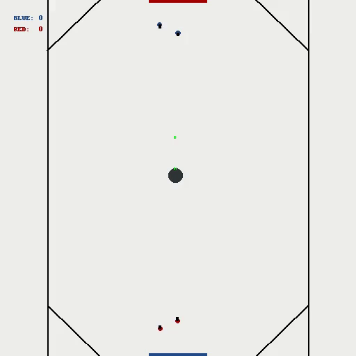
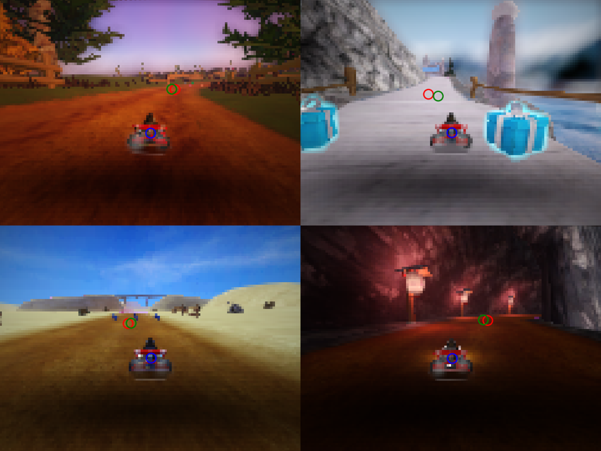

# SuperTuxKart-Racing-Vision-System-and-Ice-Hockey-Agent

## SuperTuxKart Ice Hockey State based Agent using DL-RL

**Description:**

 
We design an automated agent to play SuperTuxKart Ice Hockey which is a game featuring a vast state space, a diverse action space, and sparse rewards, presenting a highly formidable challenge. The objective of the agent is to maximize goal scoring in any difficulty and achieve victory in the match if possible. Our approach involves using imitation learning, combining both Behavioural Cloning and DAgger, to mimic other agents and learn the optimal strategy for playing the game. We employ REINFORCE on top of our best imitation agent to adjust the variables of the agent's policy in an approach that increases the likelihood of actions that result in higher rewards 1.e., an effective goal-scoring strategy. Our system is designed to exploit potential simplifications in this complex environment, with the ultimate aim of creating proficient players. We train a neural net model, inspired by the principles of imitation learning, to support a controller network to play ice hockey. Our system is state-based, focusing on the state of the game rather than the visual input from the player's field of view. 

**Contributors:** Emmanuel Rajapandian, Jean Del Rosario Pegeuro, Shubham Gupta

**My contribution:**

 
Generated training dataset of over 300 episodes of agent gameplay for imitation learning, coded and trained multi-layer perceptron model using imitation learning combining Behavioural modelling and DAgger, wrote major sections of project report.

**Report:** [[Technical report](https://github.com/emmanuelrajapandian/emmanuelrajapandian.github.io/blob/main/files/Project%20Report.pdf)]

**Game Play:**

Our team, represented by the blue players, faces off against the formidable Jurgen agent, represented by the red players, known as the strongest contender in the pool. Our agent demonstrates commendable performance both in defense and attack. This accomplishment was made possible through the integration of REINFORCE, layered atop imitation learning from the top-performing agent.

  

## SuperTuxKart Racing Vision System

**Description:**

 
Developed an image-based vision system for a racing simulator, SuperTuxKart by leveraging deep learning using Python. The initial phase involved implementing a CNN classifier using PyTorch. Employing convolutional layers, ensured effective feature extraction for classification tasks. Through hyperparameter tuning and employing various techniques such as input normalization, residual blocks, dropout, and data augmentation, the model achieved an accuracy of 94% on validation data. Transitioning from image classification to dense prediction, the CNN was converted to a Fully Convoluional Network (FCN) for semantic segmentation. This FCN is designed to handle arbitrary input resolutions and outputs predictions per pixel. Employing skip and residual connections ensured accurate object detection and segmentation. Expanding the segmentation network, it was repurposed into point-based object detection. Predicting dense heatmaps of object centers enabled efficient object localization. Implementing peak extraction algorithms facilitated the identification of relevant objects such as projectiles, karts, bombs, nitro within the scene, further enhancing the system's understanding of the environment. Beyond vision processing, a low-level controller responsible for steering the racing vehicle towards a specified aim point was integrated with the image-based predictions along with control actions, to ensure smooth and efficient navigation across diverse racing tracks. Lastly, the planner model was trained to predict aim points directly from input images. Overall, the sequential culmination of these components resulted in a high-performance vision-based system for racing simulation. This project helped me learn lot about systems that showcase the superiority of deep learning in enhancing virtual game environments (Solo Project). 

  

## Code Files
Owing to UT Austin Honor Code, the model files will not be made public.
